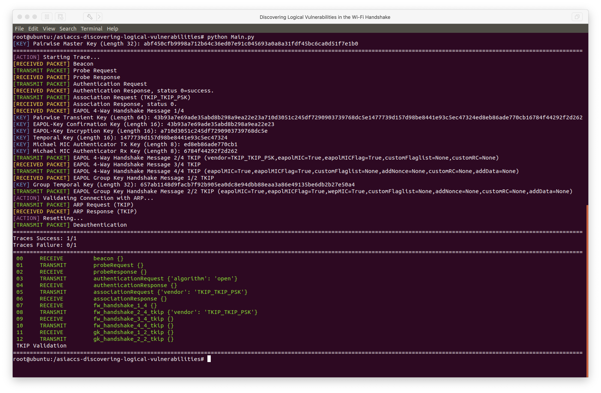

# Discovering Logical Vulnerabilities in the Wi-Fi Handshake
Code for the AsiaCCS 2017 paper "Discovering Logical Vulnerabilities in the Wi-Fi Handshake using Model-Based Testing".

https://lirias2repo.kuleuven.be/bitstream/handle/123456789/572634/asiaccs2017.pdf

## Abstract
We use model-based testing techniques to detect logical vulnerabilities in implementations of the Wi-Fi handshake. This reveals new fingerprinting techniques, multiple downgrade attacks, and Denial of Service (DoS) vulnerabilities. Stations use the Wi-Fi handshake to securely connect with wireless networks. In this handshake, mutually supported capabilities are determined, and fresh pairwise keys are negotiated. As a result, a proper implementation of the Wi-Fi handshake is essential in protecting all subsequent traffic. To detect the presence of erroneous behaviour, we propose a model-based technique that generates a set of representative test cases. These tests cover all states of the Wi-Fi handshake, and explore various edge cases in each state. We then treat the implementation under test as a black box, and execute all generated tests. Determining whether a failed test introduces a security weakness is done manually. We tested 12 implementations using this approach, and discovered irregularities in all of them. Our findings include fingerprinting mechanisms, DoS attacks, and downgrade attacks where an adversary can force usage of the insecure WPA-TKIP cipher. Finally, we explain how one of our downgrade attacks highlights incorrect claims made in the 802.11 standard.

## BibTeX
```
@inproceedings{vanhoef2017discovering,
  title={Discovering logical vulnerabilities in the Wi-Fi handshake using model-based testing},
  author={Vanhoef, Mathy and Schepers, Domien and Piessens, Frank},
  booktitle={Proceedings of the 2017 ACM on Asia Conference on Computer and Communications Security},
  pages={360--371},
  year={2017},
  organization={ACM}
}
```

## Results
Information on the results can be found on the following resources.

Paper AsiaCCS 2017:
- https://lirias2repo.kuleuven.be/bitstream/handle/123456789/572634/asiaccs2017.pdf

GitHub Mathy Vanhoef:
- https://github.com/vanhoefm/hostap-asiaccs2017

Black Hat 2017:
- https://github.com/vanhoefm/blackhat17-pocs
- http://papers.mathyvanhoef.com/blackhat2017-slides.pdf

## Code
Dependencies:
```
apt install python-scapy
pip install pycrypto
```

Remember to put your wireless interface into monitor mode:
```
ifconfig wlan0 down
iwconfig wlan0 mode monitor
ifconfig wlan0 up
```

Configure and run the program as follows:

1. Configure __initNetworkSettings() in Main.py with the information of the Access Point.

2. Configure getTraces() in TraceManager.py to define the traces to test against the Access Point.

3. Run the program:
```
python Main.py
```

<p align="center">

</p>
